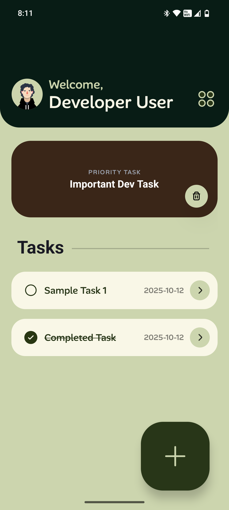
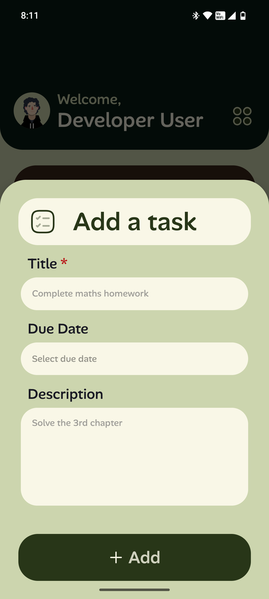
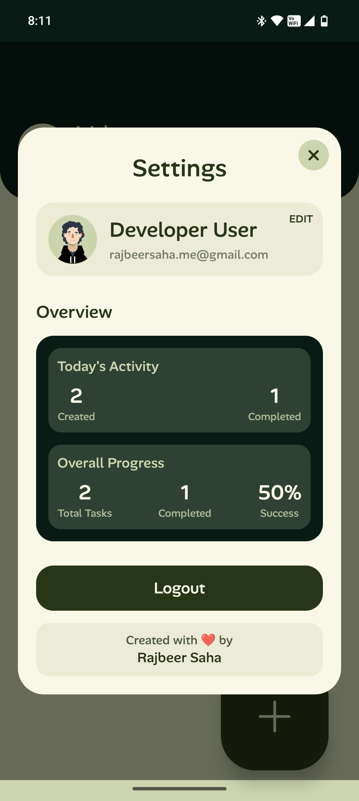

<div align="center">


# Momentum


**A Beautiful, Modern Task Management App Built with React Native & Expo**

*Stay focused. Stay productive. Build momentum.*

[📱 Download](#installation) • [✨ Features](#features) • [🎨 Screenshots](#screenshots) • [🚀 Getting Started](#getting-started)

</div>

---

## 🌟 About Momentum

**Momentum v1.0** is a sleek, intuitive task management application designed to help you build productive habits and maintain focus on what matters most. With its modern design language and powerful features, Momentum transforms the way you organize your daily tasks and urgent priorities.

### 🎯 What Makes Momentum Special?

- **🎨 Modern Design Language**: Clean, minimal interface with smooth animations
- **⚡ Lightning Fast**: Optimized performance with advanced database indexing
- **🔒 Secure Authentication**: Powered by Supabase Auth with persistent sessions
- **📱 Cross-Platform**: Built with React Native - works on iOS, Android, and Web
- **🎭 Beautiful Animations**: Powered by Lottie animations for delightful interactions
- **🌙 Intuitive UX**: Drag-and-drop task reordering with haptic feedback

---

## ✨ Features

### 🎯 **Core Task Management**
- ✅ Create, edit, and delete tasks with ease
- 📅 Set due dates and descriptions
- ✔️ Mark tasks as complete with satisfying animations
- 🔄 Drag-and-drop reordering with real-time updates
- 📊 Task statistics and completion tracking

### 🚨 **Urgent Task Focus**
- ⚡ Special "Urgent Task" section for top priorities
- 🎯 One urgent task at a time to maintain focus
- 🔥 Quick access and management

### 👤 **User Experience**
- 🔐 Secure user authentication and profiles
- 👋 Personalized onboarding experience
- ⚙️ Comprehensive settings and preferences
- 📱 Responsive design across all screen sizes

### 🎨 **Design & Polish**
- 🌈 TailwindCSS styling with NativeWind
- 🎭 Lottie animations throughout the app
- 📳 Haptic feedback for interactions
- 🌊 Smooth transitions and micro-interactions

### 🚧 **Developer-Friendly Features**
- **🔄 One-Click Development Mode** - Toggle authentication bypass with a single flag
- **🎨 UI-Only Testing** - Focus purely on design and user experience
- **📱 Instant Preview** - No login required for stakeholder demos
- **🛠️ Mock Data System** - Realistic test data for all app features
- **⚡ Rapid Iteration** - Skip authentication setup during UI development

> **Why This Matters:** Unlike typical Expo projects that require full authentication setup for testing, Momentum includes a smart development flag system. Simply toggle `DEVELOPMENT_MODE: true` in the config to bypass all authentication and work with mock data - perfect for UI development, design reviews, and quick iterations!

---

## 🔮 Upcoming Features

### 📱 **Version 1.1**
- **📡 Offline Support** - Work with your tasks even without internet connection
- **🔄 Smart Sync** - Automatic synchronization when back online

### 🌟 **Version 2.0** 
- **💬 Feedback Hub** - In-app user reviews and feature suggestions
- **📊 Community Voting** - Vote on upcoming features and improvements

*Stay tuned for these exciting updates!*

---

## 🛠 Tech Stack

### **Frontend**
- **React Native** - Cross-platform mobile development
- **Expo SDK 52** - Development platform and tools
- **TypeScript** - Type-safe JavaScript
- **Expo Router** - File-based navigation
- **TailwindCSS + NativeWind** - Utility-first styling

### **Backend & Database**
- **Supabase** - Backend-as-a-Service
- **PostgreSQL** - Robust relational database
- **Row Level Security** - Data protection
- **Real-time subscriptions** - Live data updates

### **Animations & Media**
- **Lottie React Native** - Vector animations
- **React Native SVG** - Scalable vector graphics
- **Expo Haptics** - Tactile feedback

### **Development Tools**
- **ESLint** - Code linting and formatting
- **Metro** - React Native bundler
- **EAS Build** - Cloud-based builds

---

## 🚀 Getting Started

### Prerequisites

Before you begin, ensure you have the following installed:

- **Node.js** (v18 or higher)
- **npm** or **yarn**
- **Expo CLI** (`npm install -g @expo/cli`)
- **Git**

For mobile development:
- **Expo Go** app on your phone, OR
- **Android Studio** (for Android emulator)
- **Xcode** (for iOS simulator, macOS only)

### Installation

1. **Clone the repository**
   ```bash
   git clone https://github.com/PixelPioneer404/Momentum.git
   cd Momentum
   ```

2. **Install dependencies**
   ```bash
   npm install
   ```

3. **Set up environment variables**
   ```bash
   # Create a .env file in the root directory
   cp .env.example .env
   
   # Add your Supabase credentials
   EXPO_PUBLIC_SUPABASE_URL=your_supabase_url
   EXPO_PUBLIC_SUPABASE_ANON_KEY=your_supabase_anon_key
   ```

4. **Set up the database**
   - Go to your [Supabase Dashboard](https://supabase.com/dashboard)
   - Create a new project
   - Run the SQL files in the `database/` folder:
     - `users_table.sql`
     - `tasks_table.sql`
     - `urgent_tasks_table.sql`
     - `performance_indexes.sql` (optional, for better performance)

5. **Start the development server**
   ```bash
   npx expo start
   ```

6. **Run on your device**
   - **Mobile**: Scan the QR code with Expo Go app
   - **iOS Simulator**: Press `i` in the terminal
   - **Android Emulator**: Press `a` in the terminal
   - **Web**: Press `w` in the terminal

### 🚧 **Quick Start for UI Development (No Auth Setup Required!)**

Want to explore the app UI without setting up authentication? Momentum includes a unique development mode:

1. **Clone and install** (steps 1-2 above)
2. **Enable development mode**:
   ```typescript
   // In lib/devConfig.ts
   export const DEV_CONFIG = {
     DEVELOPMENT_MODE: true, // Change to true
     // ...
   };
   ```
3. **Start the app**:
   ```bash
   npx expo start
   ```
4. **Enjoy!** - No login required, full UI access with mock data

> **🎯 Perfect for:** UI testing, design reviews, stakeholder demos, rapid prototyping

> **📋 See:** `DEV_MODE_INSTRUCTIONS.md` for complete development mode guide

---

## 📱 Screenshots

<div align="center">

| Welcome Screen | Home/Task Management | Add Task Modal | Settings |
|----------------|---------------------|----------------|----------|
|  |  |  |  |
| *Beautiful welcome experience with animations* | *Intuitive task organization & management* | *Seamless task creation flow* | *Comprehensive user preferences* |

</div>

<div align="center">
  <h3>🎨 Beautiful Design • 📱 Intuitive Interface • ✨ Smooth Animations</h3>
</div>

---

## 🏗 Project Structure

```
Momentum/
├── app/                    # Expo Router pages
│   ├── auth.tsx           # Authentication screen
│   ├── Home.tsx           # Main task management
│   ├── Onboarding.tsx     # User onboarding
│   └── _layout.tsx        # Root layout
├── components/            # Reusable UI components
│   ├── AlertToast.tsx     # Toast notifications
│   ├── ModalPopup.tsx     # Modal dialogs
│   ├── SettingsModal.tsx  # Settings interface
│   └── TaskView.tsx       # Task detail view
├── contexts/              # React Context providers
│   ├── AuthProvider.tsx   # Authentication state
│   └── UserContext.tsx    # User data management
├── lib/                   # Core business logic
│   ├── auth.ts           # Authentication utilities
│   ├── supabase.ts       # Database client
│   ├── taskService.ts    # Task operations
│   ├── urgentTaskService.ts # Urgent task operations
│   └── userService.ts    # User profile operations
├── database/             # SQL schema and migrations
├── assets/               # Images, fonts, animations
└── docs/                 # Additional documentation
```

---

## 🎨 Design Philosophy

**Momentum** follows a **modern, minimal design language** with these principles:

- **Clarity First**: Every element has a clear purpose
- **Consistent Interactions**: Predictable user experience
- **Delightful Details**: Micro-animations that add joy
- **Accessible**: Designed for users of all abilities
- **Performance**: Smooth 60fps animations and fast loading

---

## 🚀 Version 1.0 Features

This is the **initial release (v1.0)** of Momentum, featuring:

### ✅ **Completed Features**
- 🔐 Complete user authentication system
- 📋 Full task CRUD operations
- 🚨 Urgent task management
- 🎯 Drag-and-drop task reordering
- 📊 Task completion statistics
- 👤 User profile management
- ⚙️ Comprehensive settings
- 🎨 Modern UI with animations
- 📱 Cross-platform compatibility
- ⚡ Performance optimizations
- **🚧 Development Mode Toggle** - Unique feature for UI-focused development

> **⭐ Standout Feature:** Unlike typical Expo apps, Momentum includes a smart development flag that lets you bypass authentication entirely. Perfect for UI development, design reviews, and rapid prototyping without backend setup!

### 🔮 **Coming in Future Versions**
- 📅 Calendar integration
- 🏷️ Task categories and tags
- 🔔 Push notifications
- 📈 Advanced analytics
- 👥 Team collaboration
- 🌙 Dark mode theme
- 🔄 Offline synchronization

---

## 🤝 Contributing

We welcome contributions to make Momentum even better! Here's how you can help:

1. **Fork the repository**
2. **Create a feature branch** (`git checkout -b feature/amazing-feature`)
3. **Commit your changes** (`git commit -m 'Add amazing feature'`)
4. **Push to the branch** (`git push origin feature/amazing-feature`)
5. **Open a Pull Request**

### Development Guidelines

- Follow the existing code style
- Add TypeScript types for new features
- Test your changes thoroughly
- Update documentation as needed

---

## 🐛 Issues & Support

Encountered a bug or have a feature request?

- 🐛 **Bug Reports**: [Create an issue](https://github.com/PixelPioneer404/Momentum/issues)
- 💡 **Feature Requests**: [Start a discussion](https://github.com/PixelPioneer404/Momentum/discussions)
- 📧 **Direct Contact**: Open an issue for support

---

## 📄 License

This project is licensed under the **MIT License** - see the [LICENSE](LICENSE) file for details.

---

## 🙏 Acknowledgments

- **Expo Team** - For the amazing development platform
- **Supabase** - For the powerful backend infrastructure
- **React Native Community** - For the incredible ecosystem
- **Lottie** - For beautiful animations
- **All Contributors** - Thank you for making Momentum better!

---

<div align="center">

**Made with ❤️ by [PixelPioneer404](https://github.com/PixelPioneer404)**

*Star ⭐ this repository if you found it helpful!*

</div>
